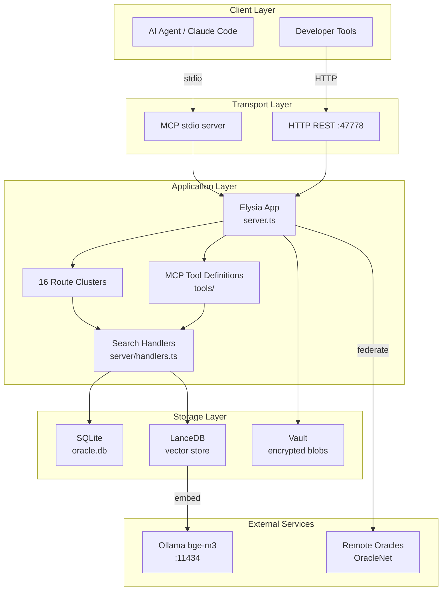
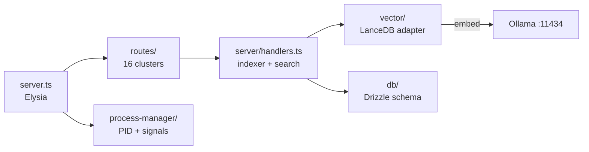

# Software Design Description — arra-oracle-v3

**Document ID:** SDD-ARRA-V3-001  
**Version:** 1.0.0  
**Date:** 2026-05-05  
**Standard:** IEEE 1016-2009  
**Status:** Draft

---

## 1. Introduction

### 1.1 Purpose
This SDD describes the internal design of **arra-oracle-v3**, an MCP (Model Context Protocol) Memory Layer that provides persistent, searchable, federated knowledge storage for AI agents and developer tools.

### 1.2 Scope
arra-oracle-v3 exposes a dual interface: an HTTP REST API (port 47778) and an MCP stdio server. It stores documents in SQLite with FTS5 full-text search, indexes embeddings in LanceDB, and enforces a "nothing is deleted" supersede pattern for document versioning.

### 1.3 Definitions

| Term | Definition |
|------|-----------|
| Oracle | A named instance of the memory layer |
| Supersede | Replace a document immutably; original is retained with forward pointer |
| Hybrid Search | Combined FTS5 + vector similarity scoring |
| OracleNet | Federation layer enabling cross-instance presence and document sharing |
| Handoff | Structured knowledge transfer payload between agent sessions |

### 1.4 References
- IEEE 1016-2009 Software Design Descriptions
- MCP Specification (Anthropic, 2024)
- Drizzle ORM / LanceDB Documentation

---

## 2. Architecture Overview

### 2.1 Deployment Topology



### 2.2 Technology Stack

| Layer | Technology | Version |
|-------|-----------|---------|
| Runtime | Bun | ≥ 1.2 |
| Web Framework | Elysia | latest |
| Schema Validation | TypeBox | via Elysia |
| ORM | Drizzle | latest |
| Database | SQLite (FTS5) | bundled |
| Vector DB | LanceDB | local file |
| Embeddings | Ollama bge-m3 | :11434 |

---

## 3. Component Design

### 3.1 Component Map



### 3.2 Route Clusters

| Cluster | Responsibility |
|---------|---------------|
| `auth/` | Session login, logout, status tokens |
| `search/` | Hybrid, FTS-only, vector-only endpoints |
| `health/` | Liveness, stats, oracle registry |
| `feed/` | Chronological activity feed |
| `knowledge/` | learn (ingest), handoff (export), inbox |
| `menu/` | Menu item CRUD + admin |
| `forum/` | Thread and message management |
| `traces/` | Trace link creation, chain traversal |
| `supersede/` | Document versioning — never deletes |
| `oraclenet/` | Federation presence, remote status sync |
| remaining | Dashboard, files, plugins, sessions, schedule, settings |

### 3.3 Search Handler (`server/handlers.ts`)

1. Parse query and filters.
2. Run FTS5 query on `oracle_documents` virtual table — returns ranked rows.
3. Generate embedding via Ollama bge-m3 (POST `http://localhost:11434/api/embeddings`).
4. Query LanceDB for top-k nearest neighbors by cosine similarity.
5. Merge result sets with weighted scoring: `score = α·fts_rank + (1−α)·vector_sim`.
6. Log query to `search_log`, update `document_access`.

### 3.4 Process Manager

Writes `~/.arra-oracle-v3/server.pid` on startup. `SIGTERM`/`SIGINT` handlers flush writes, close DB, remove PID file.

---

## 4. Data Design

### 4.1 Entity Relationship Overview

```mermaid
erDiagram
    oracle_documents {
        text id PK
        text title
        text content
        text origin
        text project
        text created_by
        text superseded_by FK
        datetime superseded_at
    }
    supersede_log { text id PK; text from_id FK; text to_id FK; text reason }
    forum_threads { text id PK; text title; text project }
    forum_messages { text id PK; text thread_id FK; text content; text author }
    trace_log { text id PK; text from_id FK; text to_id FK; text relation }
    activity_log { text id PK; text actor; text action; text target_id }

    oracle_documents ||--o{ supersede_log : "superseded via"
    oracle_documents ||--o{ trace_log : "linked from"
    forum_threads ||--o{ forum_messages : "contains"
```

### 4.2 Key Table Notes

- **oracle_documents**: Central index. `superseded_by` creates the immutable chain. FTS5 virtual table mirrors `title + content`.
- **indexing_status**: Tracks per-document embedding state (`pending | indexed | failed`).
- **search_log / consult_log / learn_log**: Audit trails for all read/write operations.
- **schedule**: Cron-style task entries consumed by the schedule route.
- **settings**: Key-value store for runtime configuration; loaded at startup into memory.

---

## 5. Interface Design

### 5.1 HTTP API Patterns

Elysia enforces TypeBox schemas on all request bodies and responses. Representative endpoints:

| Method | Path | Notes |
|--------|------|-------|
| POST | `/auth/login` | `{ token }` → session |
| GET | `/health/stats` | documents, searches, uptime |
| POST | `/search/hybrid` | `{ q, project?, alpha? }` |
| POST | `/knowledge/learn` | ingest document |
| POST | `/supersede/:id` | `{ reason, new_content }` |
| GET | `/feed` | cursor-paginated activity |
| POST | `/traces/link` | `{ from_id, to_id, relation }` |

### 5.2 MCP Interface

The stdio server in `src/tools/` exposes JSON-RPC 2.0 tools mapping to internal handlers:

| MCP Tool | Handler |
|----------|---------|
| `oracle_search` | `handlers.hybridSearch()` |
| `oracle_learn` | `handlers.ingestDocument()` |
| `oracle_handoff` | knowledge/handoff route |
| `oracle_recall` | `handlers.getDocument()` |
| `oracle_supersede` | supersede route |

---

## 6. Security Design

### 6.1 OWASP Top 10 Mitigations

| Threat | Mitigation |
|--------|-----------|
| A01 Access Control | Token auth on all non-health routes; validated against DB |
| A02 Crypto Failures | Vault uses AES-256-GCM; keys stored outside DB |
| A03 Injection | Drizzle parameterized queries; FTS5 uses bound parameters |
| A04 Insecure Design | Supersede-only pattern; all mutations in activity_log |
| A05 Misconfiguration | Port 47778 binds localhost by default |
| A07 Auth Failures | Tokens expire; logout invalidates server-side record |
| A09 Logging | search_log, consult_log, learn_log, activity_log |

### 6.2 Local-First Trust Model
arra-oracle-v3 is designed for localhost deployment. OracleNet federation uses mutual token exchange; no unauthenticated cross-instance calls are accepted.

---

## 7. Change Log

| Version | Date | Author | Description |
|---------|------|--------|-------------|
| 1.0.0 | 2026-05-05 | Soul Brews Studio | Initial SDD draft |
