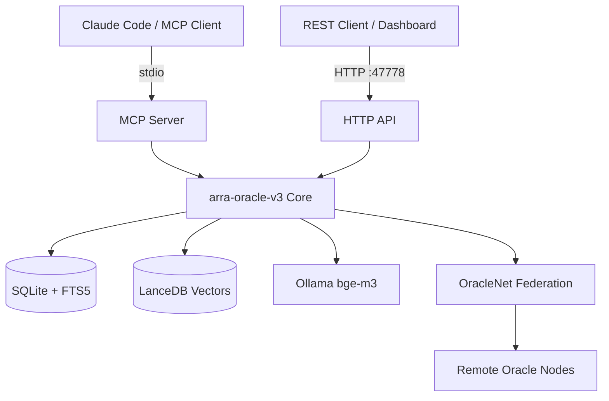
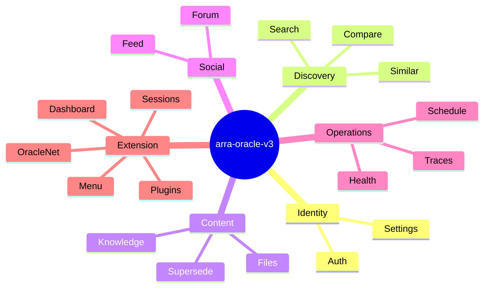

# Software Requirements Specification
## arra-oracle-v3: MCP Memory Layer

**Document ID:** SRS-ARRA-V3-001
**Version:** 1.0.0
**Date:** 2026-05-05
**Standard:** ISO/IEC/IEEE 29148:2018
**Status:** Draft

---

## 1. Introduction

### 1.1 Purpose
This SRS defines the functional and non-functional requirements for **arra-oracle-v3**, a Model Context Protocol (MCP) Memory Layer server providing semantic search, philosophy reasoning, and structured knowledge management for AI-assisted workflows.

### 1.2 Scope
arra-oracle-v3 exposes a dual-mode runtime: an HTTP REST API on port **47778** and an MCP stdio server consumed by Claude Code and compatible clients. The system ingests, indexes, retrieves, and federates knowledge documents across oracle nodes.

### 1.3 Definitions

| Term | Definition |
|------|------------|
| Oracle | A named knowledge node/identity within the system |
| Document | A stored knowledge unit in `oracle_documents` |
| Supersede | A versioned replacement of an existing document |
| Trace | An audit link between two documents or events |
| OracleNet | The peer-to-peer federation layer between oracle nodes |
| Hybrid Search | Combined FTS5 full-text + LanceDB vector search |
| MCP | Model Context Protocol (Anthropic stdio transport) |
| FTS5 | SQLite full-text search extension v5 |
| BGE-M3 | Multilingual embedding model served via Ollama |

### 1.4 References
- ISO/IEC/IEEE 29148:2018 — Systems and Software Engineering: Requirements Engineering
- MCP Specification (Anthropic, 2024)
- ISO/IEC 25010:2023 — System and Software Quality Models
- OWASP API Security Top 10 (2023)
- PDPA Thailand B.E. 2562

---

## 2. Overall Description

### 2.1 Product Perspective

### 2.2 User Classes

| Class | Description | Priority |
|-------|-------------|----------|
| MCP Client | Claude Code or AI agent consuming tool calls via stdio | Critical |
| Studio User | Human operator accessing dashboard/search UI | High |
| Oracle Admin | Configures settings, menus, plugins, schedules | High |
| Federated Node | Remote oracle exchanging feed/presence via OracleNet | Medium |

### 2.3 Operating Environment
- **Runtime:** Bun >= 1.1 on macOS/Linux
- **Framework:** Elysia (TypeScript)
- **Storage:** SQLite (WAL mode) with FTS5; LanceDB for vector indices
- **Embeddings:** Ollama local server, model `bge-m3`
- **Port:** 47778 (configurable)
- **Transport:** HTTP/1.1 REST + MCP stdio

### 2.4 Design Constraints
- Embeddings require local Ollama daemon; system degrades to FTS-only if unavailable
- SQLite is single-writer; all mutations are serialized through Bun's main thread
- MCP stdio transport is incompatible with clustered deployment

---

## 3. Functional Requirements

### REQ-AUTH-001 — Authentication
**Priority:** Must Have
Users can login with credentials, logout to invalidate session tokens, and query current auth status. Sessions are stored server-side with expiry.

### REQ-SETTINGS-001 — System Settings
**Priority:** Must Have
Administrators can retrieve (`GET /settings`) and update (`PATCH /settings`) key-value configuration pairs persisted in the `settings` table.

### REQ-FEED-001 — Activity Feed
**Priority:** Should Have
The system records and exposes a chronological activity feed. Users can create feed entries and list entries with pagination. Feed data is stored in `activity_log`.

### REQ-HEALTH-001 — Health and Diagnostics
**Priority:** Must Have
A health endpoint returns server uptime, SQLite status, LanceDB status, and Ollama connectivity. Stats endpoint exposes document counts. Oracles list returns registered oracle identities.

### REQ-DASHBOARD-001 — Dashboard Analytics
**Priority:** Should Have
Dashboard routes return: activity timelines, growth metrics (document ingestion rate), session statistics, and a summary digest. All views are computed from `activity_log` and `oracle_documents`.

### REQ-SEARCH-001 — Hybrid Search
**Priority:** Must Have
Search accepts a natural language query and returns ranked results using hybrid scoring: FTS5 BM25 rank + cosine similarity from LanceDB vector index. Supports `mode` parameter (`hybrid` | `fts` | `vector`).

### REQ-SEARCH-002 — Browse and Map
**Priority:** Should Have
List endpoint returns paginated documents. Map and map3d endpoints return coordinate metadata for 2D/3D knowledge graph visualisation.

### REQ-SEARCH-003 — Reflection and Similar
**Priority:** Could Have
Reflect endpoint generates a synthesised narrative over a result set. Similar endpoint finds the top-K documents nearest to a given document ID via vector distance.

### REQ-COMPARE-001 — Document Comparison
**Priority:** Should Have
Compare endpoint returns a diff-style similarity analysis between two documents. Agreement endpoint quantifies thematic alignment score.

### REQ-KNOWLEDGE-001 — Knowledge Ingestion
**Priority:** Must Have
Learn endpoint accepts raw text/markdown, generates embeddings via Ollama, stores the document in `oracle_documents`, and writes an index record to `indexing_status`. Inbox lists pending ingestion items. Handoff prepares a document bundle for inter-oracle transfer, logged in `learn_log`.

### REQ-SUPERSEDE-001 — Document Versioning
**Priority:** Must Have
Create supersede records a replacement document linked to its predecessor via `supersede_log`. List returns all supersede events. Chain reconstructs the full version lineage of a document.

### REQ-FORUM-001 — Threaded Discussion
**Priority:** Could Have
Users can create forum threads, retrieve individual threads, list all threads, and query thread status. Data is stored in `forum_threads` and `forum_messages`.

### REQ-TRACES-001 — Audit Traces
**Priority:** Should Have
Trace endpoints: get a single trace, list all traces, link two documents, unlink them, retrieve a trace chain, and retrieve a linked-document chain. Data is stored in `trace_log`.

### REQ-SCHEDULE-001 — Task Scheduling
**Priority:** Should Have
Schedule endpoints: create a scheduled task, list tasks, update a task's cron/payload, and export schedules as Markdown. Data is stored in `schedule`.

### REQ-FILES-001 — File and Context Access
**Priority:** Must Have
File routes expose: raw file content, parsed doc, read (line-range), context (surrounding lines), dependency graph, system logs, plugin manifests, and plugin-by-name lookup.

### REQ-PLUGINS-001 — Plugin Registry
**Priority:** Should Have
Plugins list returns all registered plugin manifests. Get-by-name returns the manifest for a named plugin. Plugin data is sourced from the filesystem plugin directory.

### REQ-ORACLENET-001 — Federation
**Priority:** Should Have
OracleNet routes: federated feed aggregation, known-oracles list, presence heartbeat, and node status. Enables peer-to-peer document exchange between oracle nodes.

### REQ-SESSIONS-001 — Session Summary
**Priority:** Should Have
Sessions summary route returns an aggregated view of the current or specified session, including document accesses logged in `document_access` and `consult_log`.

### REQ-MENU-001 — Navigation Menu
**Priority:** Must Have
Menu routes: default menu, custom menu, admin menu, admin item ordering, admin source management, studio href resolver, and studio tag lookup. Data is persisted in `menu_items`.

---

## 4. Non-Functional Requirements

### 4.1 Performance (ISO 25010 — Performance Efficiency)

| ID | Requirement | Target |
|----|-------------|--------|
| NFR-PERF-001 | Hybrid search p95 latency (index warm) | < 300 ms |
| NFR-PERF-002 | Document ingestion including embedding | < 2 s |
| NFR-PERF-003 | Health check response time | < 50 ms |
| NFR-PERF-004 | Concurrent HTTP connections supported | ≥ 100 |

### 4.2 Security (OWASP API Security Top 10)

| ID | Requirement |
|----|-------------|
| NFR-SEC-001 | All state-mutating endpoints require valid session token (OWASP API2 — Broken Authentication) |
| NFR-SEC-002 | Request bodies validated against schema; malformed input rejected with 400 (OWASP API3) |
| NFR-SEC-003 | File read endpoints restrict paths to configured base directory; no path traversal (OWASP API8) |
| NFR-SEC-004 | OracleNet federation endpoints authenticate peer identity via shared secret (OWASP API2) |
| NFR-SEC-005 | SQL queries use parameterised statements exclusively; no string interpolation (OWASP API9) |

### 4.3 Data Protection (PDPA Thailand B.E. 2562)

| ID | Requirement |
|----|-------------|
| NFR-PDPA-001 | Personal data stored in documents is accessible only to the authenticated oracle owner |
| NFR-PDPA-002 | Data deletion requests must propagate to both SQLite records and LanceDB vector index |
| NFR-PDPA-003 | Access to `document_access` and `consult_log` is restricted to admin role |

### 4.4 Reliability (ISO 25010 — Reliability)

| ID | Requirement |
|----|-------------|
| NFR-REL-001 | System recovers from Ollama unavailability and falls back to FTS-only search |
| NFR-REL-002 | SQLite WAL mode ensures reads never block writes beyond 5 s |
| NFR-REL-003 | Target availability: 99.5% over any 30-day window for local deployment |

### 4.5 Maintainability

| ID | Requirement |
|----|-------------|
| NFR-MAINT-001 | Each route cluster is isolated in its own Elysia plugin file |
| NFR-MAINT-002 | Database migrations are versioned and idempotent |
| NFR-MAINT-003 | Embedding model is configurable via settings; not hard-coded |

---

## 5. Change Log

| Version | Date | Author | Description |
|---------|------|--------|-------------|
| 1.0.0 | 2026-05-05 | Soul Brews Studio | Initial SRS based on v3 route audit |
